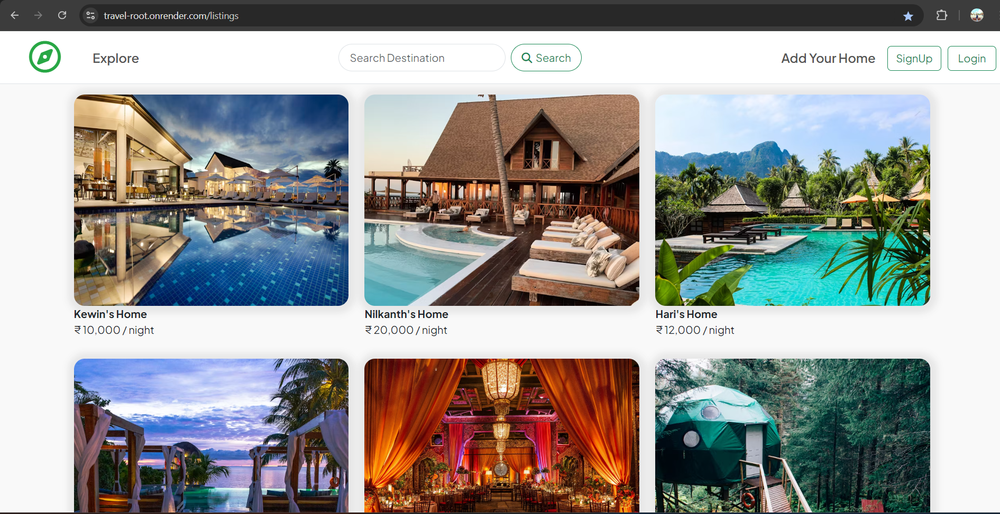

# Travel-Root


<a href="https://travel-root.onrender.com" target="_blank">Live Website</a>

**Travel-Root** is a web application that allows users to view, add, and manage travel destination listings. Built using Node.js, Express, and MongoDB, it provides user authentication, reviews, and the ability to comment on listings and reviews, as well as a map view feature for better visualization of destinations. The application promotes a community-driven approach to sharing travel experiences.


## Table of Contents
- [Features](#features)
- [Technologies Used](#technologies-used)
- [Screenshots](#screenshots)
- [Installation](#installation)
- [Usage](#usage)
- [Upcoming Features](#upcoming-features)
- [Contribution](#Contributing)


## Features
- User Authentication (Login/Signup)
- Add, Edit, or Delete Travel Listings
- Review and Comment System for travel listings and reviews
- Map View of travel destinations
- Responsive UI built with EJS and Bootstrap
- Integrated error handling
- Image upload and cloud storage functionality


## Technologies Used
- **Frontend:** EJS, Bootstrap
- **Backend:** Node.js, Express.js, MongoDB
- **DataBase:** MongoDB
- **Authentication:** Passport.js
- **Cloud Storage:** Cloudinary (for image uploads)
- **Others:** Express-Validator, Joi (For Schema validatation)


## Screenshots

Here’s a snapshot of the website:



## Installation

1. Clone the repository:
    ```bash
    git clone https://github.com/Kevin-Dobariyaa/Travel-Root.git
    cd travel-root
    ```

2. Install dependencies:
    ```bash
    npm install
    ```

3. Set up your environment variables:
    Create a `.env` file in the root directory and add your MongoDB URI, Cloudinary keys, and session secret.

4. Run the app:
    ```bash
    node app.js
    ```

5. Navigate to `localhost:8080` in your browser.

## Usage

Once deployed, Travel-Root allows users to create an account, view listings, and interact with the community by adding and reviewing travel destinations.

### Key Routes:
- `/listings` - View all travel listings
- `/listings/new` - Add a new listing
- `/listings/:id` - View a specific listing
- `/users/login` - Login to your account
- `/users/signup` - Create a new account


## Upcoming Features

- **Search by location**: Users will be able to search for listings based on their geographic location.
- **Filtering options**: Users will be able to filter listings by various parameters such as price, rating, and category.
- **Booking system**: A feature to book places directly through the platform will be introduced.


## Contributing

We welcome contributions! If you'd like to improve Travel-Root by adding new features, fixing bugs, or enhancing the design, feel free to submit a pull request or open an issue. Let's build something amazing together!


